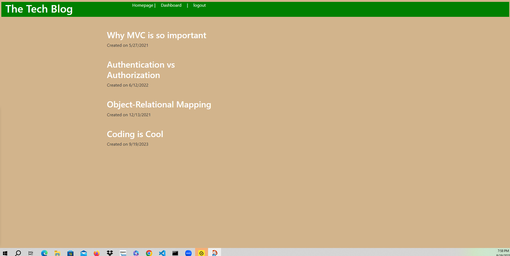
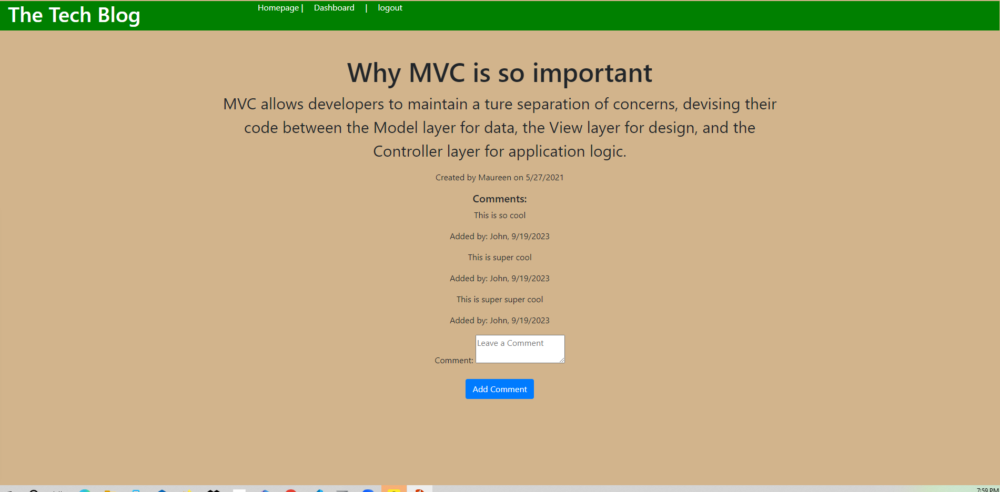

# Tech Blog

# Description
    - This project involved creating an interactive Tech Blog.
    - The Tech Blog is deployed through Heroku. 
    - The user is able to view the current blog posts on the homepage of the application. 
    - Once the user logs in, then the user is presented with the ability to add comments to posts, add new posts and update or delete posts. 
       
    
# Installation
    - Follow the link below to the URL.

    -Follow the following URL to the deployed webpage: https://caf62219-tech-blog-171b0459e5d1.herokuapp.com/
    
    
        
    
# Usage
    

    - This is an image of the homepage that the user will see upon logging in.
    - If the user clicks on dashboard the user will see the posts that they have made and have the option to add a new post.

   
    
    -   This image is of the ability to add a comment when logged in.

# Credits
    Donnie Rawlings: https://github.com/drawlin22/
    Kyle Jocoy: https://github.com/Kylyote/
    Nedda Elsayed: https://github.com/Lven-Nemsy
    ASK BCS Alex Bradshaw
    ASK BCS Jon
    ASK BCS Jerromy Chance
    TA Jamie Otto
    Instructor John Young

      
# License
    MIT

